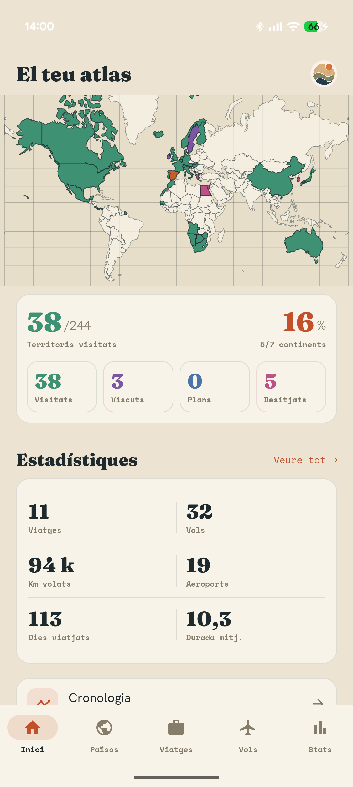
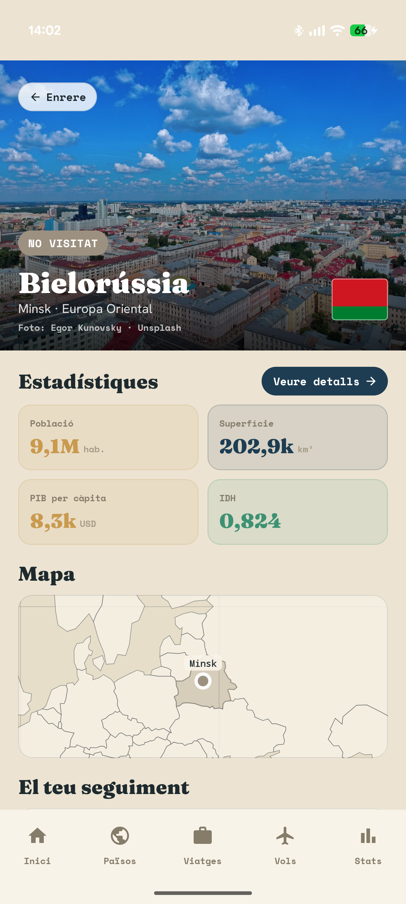
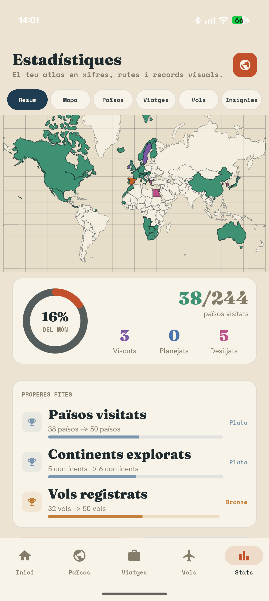

# Atlas

### Your travels, all in one place

Atlas is a personal travel journal for Android. See the places you have visited on a map, keep your trips and flights together, and return to the photos and stories behind them. Build your own atlas at your own pace: a country, a quick trip, or a detailed itinerary can all be useful without filling in every field.

Track countries and territories you have visited, lived in, or hope to see. Explore country facts, follow your travel history through maps and statistics, and keep your memories with your records. Your atlas lives on your device, with explicit export and restore when you want a portable copy.

<p align="center">
  
  
  
</p>

<p align="center"><em>Your atlas · Places and country facts · Travel statistics</em></p>

## What you can do

- Record countries and territories as visited, lived in, wished for, or planned.
- Create trips with stops and excursions, including a quick flow for a single-location trip.
- Log flights and build itineraries that connect the places in a journey.
- Browse maps, a travel timeline, country information, and personal statistics.
- Attach photos to trips and stops, then revisit them through galleries and memories.
- Export and restore your data, including photos, in a portable `.atlasbackup` archive. Optional scheduled backups use a folder you choose.

Atlas is a local-first personal project in active development. It has no Atlas account or backend requirement. Some country imagery and information can use optional external sources; your saved travel records remain usable locally. The visible interface is Catalan-first.

## Built with

Kotlin, Jetpack Compose and Material 3 for the native Android UI; Room for local persistence; Coroutines and Flow for reactive state; DataStore for preferences; and `kotlinx.serialization` for datasets and backups. Maps use bundled geographic data with Compose Canvas and MapLibre where tile maps are appropriate. Coil loads images, and WorkManager handles optional scheduled backup work.

The code follows `UI → Presentation → Domain → Data`. ViewModels expose screen state, domain services own travel rules, and repositories keep Room, bundled datasets, and external services behind data interfaces. Database migrations and backup compatibility matter because the app already contains real user data. See the [technical architecture](docs/Atlas_Technical_Architecture.md) and [data model](docs/Atlas_Data_Model.md) for details.

## Build and run

1. Install Android Studio with Android SDK 35 and JDK 17.
2. Open this repository in Android Studio and let Gradle sync.
3. Run the `app` configuration on a device or emulator running Android 8.0 (API 26) or newer.

From a terminal with the Android SDK and JDK 17 configured:

```text
./gradlew assembleDebug
./gradlew testDebugUnitTest
```

On Windows, use `gradlew.bat` instead of `./gradlew`. The debug build uses the separate `com.atlas.debug` application ID so it can coexist with a regular installation. No API key is required to build the core local experience; some optional online content may be unavailable without its service configuration or a network connection.

## Project and development

This repository is a working app and an ongoing personal project. It is developed with AI-assisted coding and review workflows; product decisions, integration, and validation are part of the project work. The [agent setup](README_AGENTIC_SETUP.md) explains that workflow. The [documentation index](docs/README.md) distinguishes current implementation from long-term ideas and older milestone notes.
